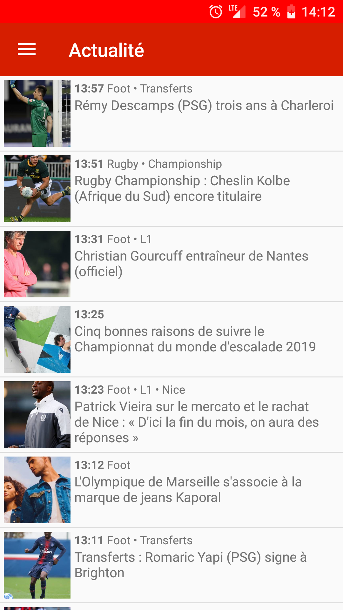
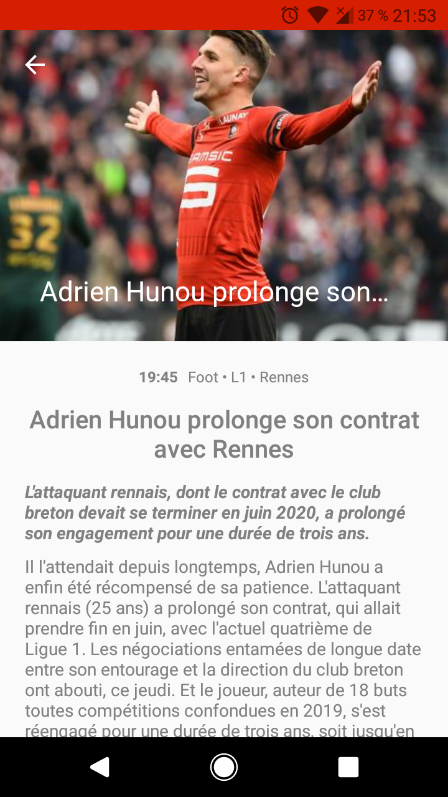
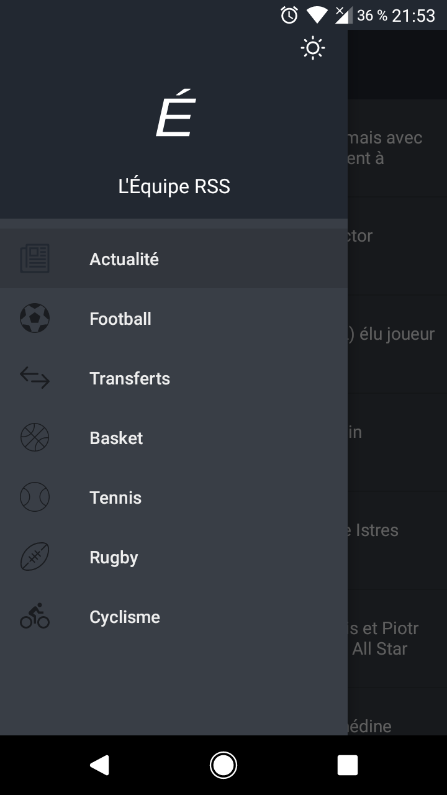
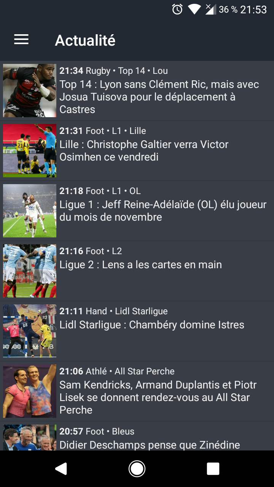

# Download

# EquipeRSS

This application is a RSS reader for the french newspaper *lequipe.fr*.

It has several goals:

 * fast loading
 * no ad tracking
 * low battery consumption

## Fast loading
 
This application is optimized to load only relevant datas in articles.

## No ad tracking

No tracking tool is included in this application.

## Low battery consumption

With dark theme, you can save battery life on your phone by displaying the application with dark colors.

